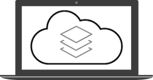

# spring-localstack

## About
This project is a working example built with `kotlin` + `spring framework` on how to use `localstack` for testing aws cloud environment.

Also it makes use of `terraform` to automate the creation of the cloud infrastructure, and `terraform-compliance` to ensure terraform is tested following a BDD strategy.

## Stack used





## Localstack

Running localstack:
```sh
SERVICES=s3 docker-compose -f docker-compose.localstack.yml up -d
```
On mac:
```sh
TMPDIR=/private$TMPDIR SERVICES=s3 docker-compose -f docker-compose.localstack.yml up -d
```


## Terraform:

Init:
```sh
terraform init
```

Plan:
```sh
terraform plan -var-file=dev/terraform.tfvars
aws-vault --debug exec <PROFILE> -- terraform plan -var-file=dev/terraform.tfvars
```

## Terraform compliance
Running tests:
```sh
docker run --rm -v $PWD:/target -i -t eerkunt/terraform-compliance -f terraform/test -t terraform-modules/s3
```

## API calls

Create bucket:
```sh
POST / HTTP/1.1
Host: localhost:9090/create-bucket?bucket-name=created-bucket-api
```

List objects from bucket:
```sh
GET / HTTP/1.1
Host: localhost:9090/list-objects-bucket?bucket-name=created-bucket-api
```

Upload object to bucket:
```sh
GET / HTTP/1.1
Host: localhost:9090/upload?bucket-name=created-bucket-api

Content-type: multipart/form-data
```

Download object from bucket:
```sh
GET / HTTP/1.1
Host: localhost:9090/download?bucket-name=created-bucket-api&object-key=application.properties
```

